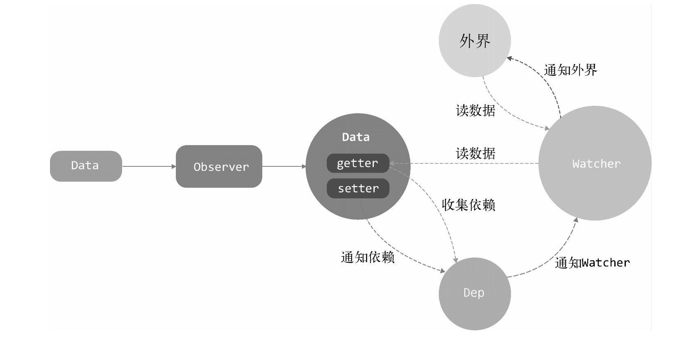

Data通过Observer转换成了getter/setter的形式来追踪变化。
当外界通过Watcher读取数据时，会触发getter从而将Watcher添加到依赖中。
当数据发生了变化时，会触发setter，从而向Dep中的依赖（Watcher）发送通知。
Watcher接收到通知后，会向外界发送通知，变化通知到外界后可能会触发视图更新，也有可能触发用户的某个回调函数等。



Dep会记录数据发生变化时，需要通知哪些Watcher
Watcher中也同样记录了自己会被哪些Dep通知：  通知移除（unwatch原理）
Watcher和Dependency是多对多的关系，通过addDep和addSub函数（exp是函数的话就可能是1个watch里有多个dep）


Observer主要包含两部分
构造响应式数据，生成响应式数据有三个方法，defineDirective、observe和set，defineDirective用于个对象的一个属性设成响应式，用于prop，observe用于把整个对象设成响应式，用于data
为响应式数据添加watch

哪些数据是响应式的
_props
_data

dep和watcher关系
一个响应式数据（可能是对象，可能是属性）对应一个dep
一个回调函数对应一个watcher
dep和watcher是多对多关系：可能多个响应式数据对应同一个回调函数，可能多个回调函数监听同一个响应式数据

# array
observeArray

push()、pop()、shift()、unshift()、splice()、sort()、reverse()
由于 JavaScript 的限制， Vue 不能检测以下变动的数组：
当你直接设置一个项的索引时，例如：vm.items[indexOfItem] = newValue
当你修改数组的长度时，例如：vm.items.length = newLength

# 数据监听
相关代码主要在core/observer里面。

数据来源： data， $set, watch, computed

类
函数： observe defineReactive

# Observer
__ob__: observer对象，dep实例就在这上面
每次调get，都会调dep.depend，depend会判断是不是新依赖，是的话就会收集进去。也就是本身的实例化和watcher无关，watcher是后面添加进去的。
通过dep生成响应式数据。


Observer在哪里调用的？
initState => initData： observe(data, true /* asRootData */)

# Dep
每个对象有自己的dep，对象的值的属性还有dep，也就是说observe一个对象属性，至少有两个dep

# watch

与响应式数据关联，添加进依赖收集的subs里面(初始化的时候会调用get =》 dep.depend => watcher.newDeps.push(dep) =》 dep.addSub(watcher))
vm和expOrFn匹配出来的数据必须要是响应式的。

当expOrFn是函数时，Watcher会同时观察expOrFn函数中读取的所有Vue.js实例上的响应式数据。也就是说，如果函数从Vue.js实例上读取了两个数据，那么Watcher会同时观察这两个数据的变化，当其中任意一个发生变化时，Watcher都会得到通知。

dep和watch关联
addDep: dep添加到watch的deps里面
addSub: watch添加到dep的subs里面

一个属性上可能有多个watcher吗？
给一个响应式的数据添加watch，会有两个watcher吗？再添加


创建watcher场景
```js
实例 new Watcher(vm, updateComponent, noop, {
    before () {
      if (vm._isMounted && !vm._isDestroyed) {
        callHook(vm, 'beforeUpdate')
      }
    }
  }, true /* isRenderWatcher */)
computed  watchers[key] = new Watcher(vm, getter || noop, noop, computedWatcherOptions)
$watch new Watcher(vm, expOrFn, cb, options)
```

# set
为什么target不能是Vue.js实例或者Vue.js实例的根数据对象？

Array的处理逻辑，key已经存在的处理逻辑，新增属性的处理逻辑
# delete

## 问题
watch有哪些参数？怎么实现的？deep，immediately
unwatch怎么实现的？
data变化怎么触发重新渲染的？
在mountComponent的时候，给vm实例绑定了一个叫updateComponent的watche。

# 问题
__ob__是什么？有什么用？
observe实例，内部用来判断一个对象有没有被响应式


几个实例分别保存在哪里的？怎么获取的？
dep
普通对象是存在observe实例里，对象的属性是对get函数上层，就是通过闭包去保存的


组件之间怎么通知更新的？

dep和watcher的关系是什么？
每个属性一个dep,有个subs数组，可能多个watcher，每个watcher一个deps
每次get都会触发dep.depend -> watcher.addDep，会判断dep是否存在deps

observe和defineReactive关系
每个对象生成一个observe实例，会挂载一个__ob__，defineReactive对对象的属性进行响应式，observe实际也是调用的defineReactive对每个属性进行响应式绑定。如果属性值是对象，也会动用observe去监听
简单来说，就是一个是处理对象，一个是处理对象的属性

## vue会创建哪些响应式数据
inject initInjections defineReactive
实例上的一些属性 initRender defineReactive $attrs $listeners
props
  initProps defineReactive
  validateProp observe(value)？
data initData  observe(vm.$options.data, true)或者 observe(vm._data = {}, true)

Vue.util.defineReactive(this, '_route', this._router.history.current);
# 函数类
observe(value, isRoot): 将一个对象改造成响应式,
  new Observer
  __ob__
defineReactive(obj, key, value) 为对象属性添加get,set
  observe
  new Dep
    getter
      dep.depend
      childOb.dep.depend()
    setter
      dep.notify
Observer
  constructor
  walk: defineReactive
  protoAugment
  observeArray: new Observer
Dep
  depend
    target.addDep
  notify
    sub.update
Watcher
  constructor
    getter
    get: 与dep关联
  addDep
    dep.addSub
  update
    update
    run
      get() // 获取新的值
      cb() // 只有$watcher有回调


pushTarget
popTarget
